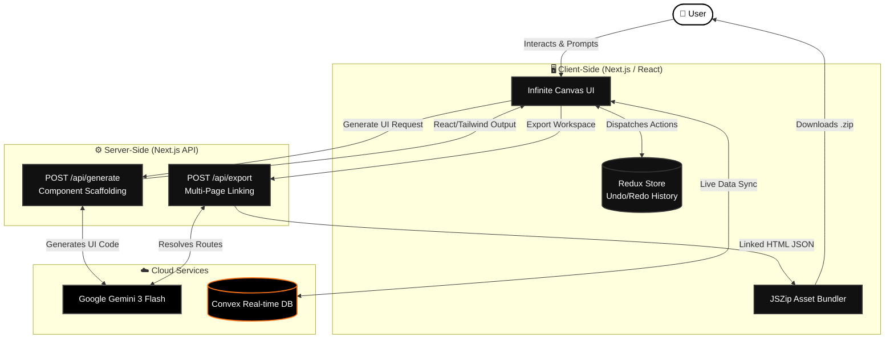
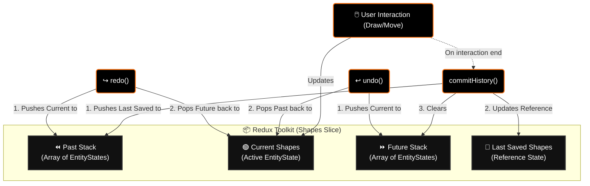

<div align="center">
  <br />
  <h1>Samsaar</h1>
  <p>
    <strong>Your ideas, in moments.</strong>
  </p>
  <br />
</div>

## 🌟 Overview

**Samsaar** is a website that allows users to utilize generative AI to transform their ideas into production-grade UI in seconds. It also offers an infinite canvas for creators to seamlessly iterate and build their next big idea.

## ✨ Key Features

- ♾️ **Infinite Canvas Editor**: A fluid, drag-and-drop workspace powered by React and a Redux store (refer to Web Dev Prodigy's video and Excalidraw clone by Code with Antonio).
- 🧠 **AI Generation Engine**: Harness the power of generative models to immediately scaffold user interfaces, complete pages, and dynamic components.
- 🔗 **Smart Multi-Page Export**: Effortlessly export your generated designs to `.zip`. The server-side AI intelligently processes multiple pages, automatically interlinking routing paths so your downloaded HTML works natively out of the box.
- ⏪ **Robust State Management**: Powered by Redux Toolkit, featuring a custom implementation for seamless **Undo** (`Ctrl+Z`) and **Redo** (`Ctrl+Y` / `Ctrl+Shift+Z`) capabilities tailored specifically to the canvas state history.
- ⚡ **Real-time Backend**: Integrated natively with Convex for real-time application state, instant queries, and mutations.

## 🏗️ Architecture Workflow



### 📦 Redux State Architecture (Undo / Redo)



## 🚀 Tech Stack

- **Frontend Framework**: [Next.js](https://nextjs.org/) (App Router, Turbopack)
- **Styling**: [Tailwind CSS](https://tailwindcss.com/) & [Shadcn UI](https://ui.shadcn.com/)
- **State Management**: [Redux Toolkit](https://redux-toolkit.js.org/)
- **Backend & Database**: [Convex](https://www.convex.dev/)
- **Icons**: [Lucide React](https://lucide.dev/)
- **AI Integration**: Server-side routing utilizing Google Gemini capabilities.

## 🛠️ Getting Started

First, clone the repository and install the dependencies:

```bash
npm install
# or
yarn install
# or
pnpm install
```

Next, initialize the Convex backend:

```bash
npx convex dev
```

Finally, start the development server:

```bash
npm run dev
# or
yarn dev
# or
pnpm dev
```

Open [http://localhost:3000](http://localhost:3000) with your browser to experience Samsaar.

## 📁 Key File Structure

- `src/app/` - Next.js App Router endpoints, pages, and API routes.
- `src/components/canvas/` - The core engine of the infinite workspace and the shape renderer.
- `src/redux/slice/shapes/` - The comprehensive state logic, managing shapes and powering the history system.
- `src/app/api/export/` - Server-side AI logic for smart JSZip bundling and multi-page routing configuration.
- `convex/` - Backend queries, mutations, and database schemas.

## 🤝 About

This project was developed rapidly as part of a Hackathon, focusing on building high-end user experiences combined with powerful AI scaffolding capabilities. 

---
<div align="center">
  Built with ❤️ for creators, developers, and visionaries.
</div>
