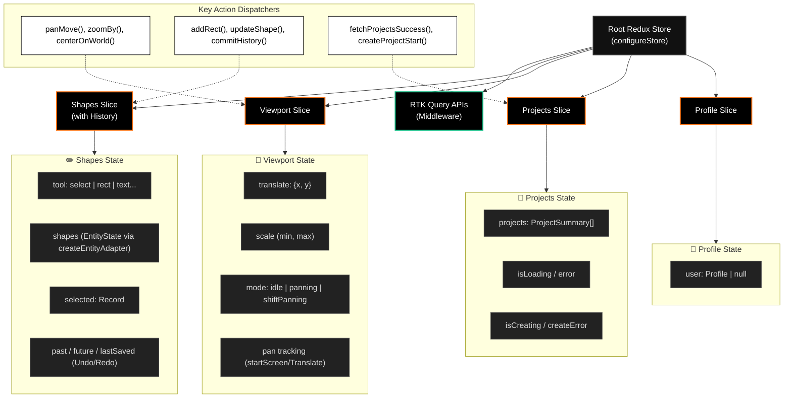

# Samsaar: Complete Redux Architecture

The Redux store in Samsaar is structured to handle everything from user authentication to real-time infinite canvas manipulations and robust history tracking. 

It is divided into **four main slices** and utilizes **RTK Query** for API management and data fetching middleware.

## The Global State Tree

## Slice Breakdown

### 1. `shapes` Slice
The powerhouse of the application. It manages the infinite canvas elements using Redux Toolkit's `createEntityAdapter` for O(1) performance when looking up, updating, or deleting shapes (rectangles, text, AI-generated UI, etc.). It also uniquely implements its own Undo/Redo stack arrays (`past` and `future`) that take snapshots of the canvas.

### 2. `viewport` Slice
Handles the camera math for the infinite canvas. It stores the zoom `scale`, XY `translate` offsets, and current interaction `mode` (like panning vs. idle). Complex actions like `zoomAroundScreenPoint` calculate exactly how to shift the translation offsets so the screen zooms directly into where the user's mouse pointer is resting.

### 3. `projects` Slice
Manages the user's dashboard of projects. It controls pagination (`total`), caching timelines (`lastFetched`), and the UI loading states (`isLoading`, `isCreating`) ensuring that fetching from the backend (Convex) is represented smoothly in the UI without race conditions.

### 4. `profile` Slice
A lightweight slice simply holding the authenticated user's `Profile` object to make session data easily accessible anywhere in the component tree.

### 5. `api` Middleware
The root `store.ts` injects RTK Query APIs. It reduces the API endpoints into the root reducer map and concats their custom middleware, allowing Samsaar to handle caching, invalidation, and server-side querying elegantly.
